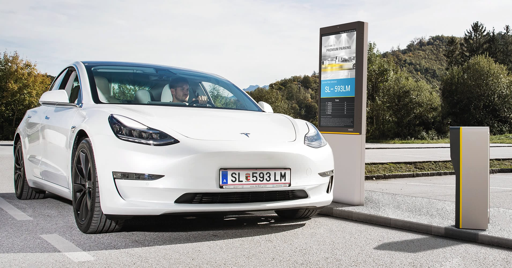

# SafeLicensing

This project demonstrates a pipeline for detecting license plates in images using YOLOv8 and encrypting the detected regions with a Chaotic Logistic Map encryption algorithm. It provides a user-friendly interface built with Streamlit.

>[!TIP]
> You can directly test the application on the web using the following link: [](https://share.streamlit.io/fahimfba/yolov8-license-plate-detection-and-encryption/main/app.py)

## Features

- **License Plate Detection**: Uses the YOLOv8 model to detect license plates in uploaded images.
- **Chaotic Encryption**: Encrypts the detected license plate regions using a two-layer XOR-based chaotic logistic map algorithm.
- **Streamlit Web App**: A simple interface to upload images, detect license plates, encrypt them, and download the results.

## Installation

1. Clone the repository:
   ```bash
   git clone https://github.com/FahimFBA/SafeLicensing.git
   cd SafeLicensing
   ```

2. Install `ffmpeg` for video processing (Linux):
   ```bash
   sudo apt-get install ffmpeg
   ```

   or, for macOS:
   ```bash
   brew install ffmpeg
   ```

3. Install the required dependencies:
   ```bash
   pip install -r requirements.txt
   ```

4. Download the YOLOv8 weights file (`best.pt`) and place it in the root directory of the project. You can train your own model or use a pre-trained one. This repository already have our model from [SEncrypt](https://github.com/IsratIJK/SEncrypt) located in [best.pt](./best.pt) file.

## Usage

1. Run the Streamlit app:
   ```bash
   streamlit run app.py
   ```

2. Open the app in your browser (typically at `http://localhost:8501`).

3. Follow the steps:
   - Upload an image or provide a URL.
   - Adjust the encryption key seed using the slider.
   - Click the "Detect & Encrypt" button to process the image.

4. Download the encrypted image directly from the app.

## Workflow

1. **License Plate Detection**:
   - The YOLOv8 model is used to detect license plates in the input image. The model has been taken from [SEncrypt](https://github.com/IsratIJK/SEncrypt).
   - Detected regions are highlighted with bounding boxes.

2. **Chaotic Logistic Map Encryption**:
   - A chaotic logistic map generates two XOR-based encryption keys.
   - Pixels in the license plate regions are shuffled and encrypted in two stages.
   - The encrypted region replaces the original plate in the image.

3. **Visualization and Download**:
   - The original, detected, and encrypted images are displayed in the app.
   - Encrypted images can be downloaded as PNG files.

## Files

- `app.py`: The main Streamlit app file.
- `requirements.txt`: Python dependencies for the project.
- `best.pt`: YOLOv8 weights file (not included, add your own).

## Key Parameters

- **Encryption Key Seed**: A slider in the app adjusts the seed value for the chaotic logistic map, affecting the encryption's randomness.

## Example Screenshots

### Original Image



### Encrypted Image


## License

This project is licensed under the MIT License. See the [LICENSE](LICENSE) file for more details.

## Contact

For any queries, feel free to reach out:

- **Author**: Md. Fahim Bin Amin
- **GitHub**: [FahimFBA](https://github.com/FahimFBA)

- **Other Authors**: [Rafid Mehda](https://github.com/rafid29mehda), [Israt Jahan Khan](https://github.com/IsratIJK)

